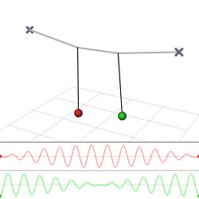

# Coupled-oscillations

~ Coupled oscillations govern the universe



## 🛠 Installation Instructions


### 📦 Clone the Repository

```bash
git clone https://github.com/your-username/Coupled-oscillations.git
cd Coupled-oscillations
```

---

### 🔧 Prerequisites

Make sure the following are installed on your system:

- **Python 3.9+**
- **Node.js (v16 or higher)** and **npm**

---

### 🐍 Python Backend Setup

```bash
python -m venv venv
source venv/bin/activate       # On Windows: venv\Scripts\activate
pip install -r requirements.txt
python backend.py
```

---

### ⚡️ Frontend Setup (Vite + Node.js)

```bash
cd frontend
npm install
npm run dev
```

The frontend will start on [http://localhost:5173](http://localhost:5173) by default.

